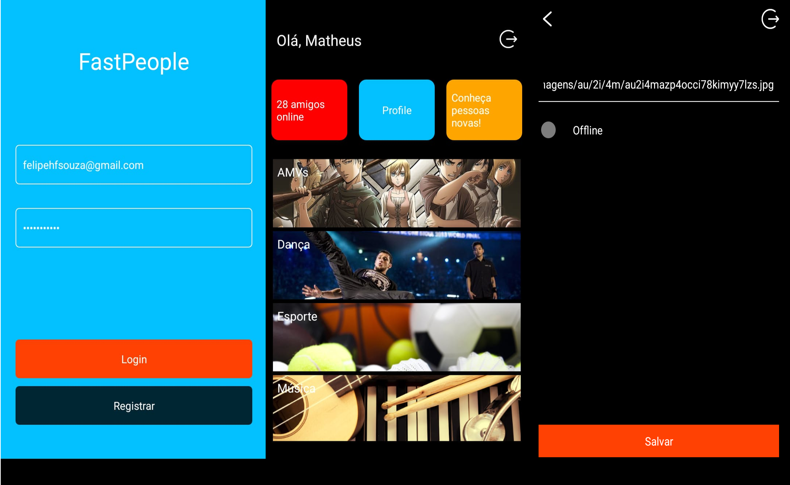

# Fast People

Uma api GRAPHQL de um agregador de vídeos de dança, amvs, música da internet.

- [x]  Registrar usuário no servidor Graphql.
- [x]  Login de usuário no servidor Graphql.
- [x]  Redirecionar para um video aleatório da categoria quando clicar na categoria. Ela deverá abrir uma webview com o vídeo do Youtube.
- [x]  Criar uma tabela de profile ela terá as seguintes colunas: owner: users_id, online: boolean, avatar: string.
- [x]  Construir o context e a parte de autenticação no servidor Graphql.
- [x]  Criar uma query chamada profile que irá usar o token passado e retornar todas as informações do usuário.